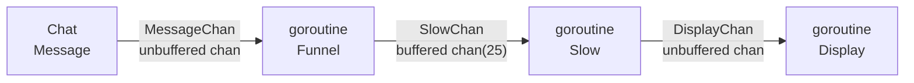

## Slower twitch irc chats

This application allows you to smooth the speed of Twitch messages to read them more easily. For this we use a buffered channel and goroutines which are responsible for funneling, slowing and displaying the messages.



## Quick start

```bash
# build and run
go mod tidy && go build ./src/main.go && ./main
```

```bash
# build and run in docker
./build.sh && ./run.sh
```

## Goals

- learning goroutines / channels in golang
- manage basic command line interface parameters
- learn to dockerize golang app
